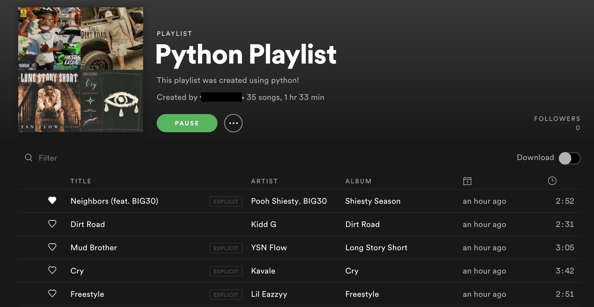

# How to Find New Songs on Spotify Using Machine Learning




## Overview

**Check out my in-depth description on Medium here:** 

https://lognorman.medium.com/how-to-find-new-songs-on-spotify-using-machine-learning-d99bd8855a18

Like many others, I've experienced the immaculate song recommendations Spotify gives to its users. In this project, I create a recommendation algorithm to give song recommendations on Spotify.

This repository walks you through everything I did to build the algorithm:

1. Created a data pipeline to construct a dataset of nearly ***10,000 songs*** to use as song recommendations by using Spotify's API to gather the first 50 songs of the official Spotify accounts' ***1000+ playlists***
2. Scraped the user's top songs to base the recommender on by using Spotify's API
3. Explored user's data to understand their music preferences and history
4. Developed a classification algorithm with ***99% accuracy*** to use to recommend songs
5. Saved recommended songs from the algorithm to a Spotify playlist within the user's account

## Installation & Requirements

Clone this repo, create a blank Anaconda environment, and install the requirements file.
```bash
# Creates new environment called 'spotify_recommender'
conda create -n spotify_recommender python=3.9
# Activates the environment we just made
conda activate spotify_recommender
# Install the requirements
pip install -r requirements.txt
```

To get your Spotify data, it is necessary to use Spotify's API. In order to do this, become a developer and create an app at this link:

https://developer.spotify.com/dashboard/

Go to your new developer dashboard and click on ‘Create an App’. You can name it whatever you want, just try to avoid using ‘Spotify’ in the name, or it might get blocked.

We need to provide a ‘redirect link’ that we’ll use to collect the user’s permission. From your app’s panel in the developer dashboard, click on ‘Edit Settings’ and add a link under Redirect URIs. This doesn’t have to be a real link: if you don’t have a website, you can simply use 

http://localhost:7777/callback

Take note of your client ID and client secret. You’ll find them in the app panel under your app’s name. 

While not required to recieve song recommendations, learning more about my listening history was one of the highlights of this project. If you'd like to explore your streaming history using the notebook in this repo, access your Spotify account dashboard at 

https://developer.spotify.com/dashboard/

In the privacy settings, you’ll find the option to request your data. This requires some patience. Spotify says it takes up to thirty days, but it’s usually much faster.

Once you've got your streaming history, clone [this GitHub repo ](https://github.com/vlad-ds/spoty-records)to create a dataframe of your streaming history. The dataframe created from that repo can replace the file 'streaming_history.csv' in this repo. 

Now you have all you need to access your Spotify data! 🎧
## Usage
Each notebook walks you through how it was made, the tasks of certain cells, and explains how to run it. 
### [Data Engineering](data_engineering.ipynb)
 To get recommended songs, start out in this notebook. This notebook is where the dataset of your top 50 songs on Spotify is created as well as the dataset filled with song recommendations. These two datasets are necessary to build a playlist of Spotify recommendations.
### [Model Creation & Playlist Development](model_creation.ipynb)
This notebook is where the development of the recommendation algorithm was made. By following the instructions inside the notebook, you will pass the datasets created in the previous notebook through the model, generate recommendations from the dataset of song recommendations, and save a playlist of recommended songs from the model to your Spotify account titled 'Your New Jams'. Enjoy your new tunes!
### [Data Exploration (Optional)](data_exploration.ipynb)
To explore your data, follow the instructions in the [Installation & Requirements](#Installation-&-Requirements) section to get your streaming history from Spotify. From there, follow the instructions in the notebook to get insights on your streaming history.

## References
[Get Your Spotify Streaming History With Python](https://github.com/vlad-ds/spoty-records)

[Airflow for Beginners - Run Spotify ETL Job in 15 minutes!](https://www.youtube.com/watch?v=i25ttd32-eo&t=14s)

[Spotipy Documentation](https://spotipy.readthedocs.io/en/2.7.0/)

[Similar Spotify Recommender](https://github.com/isacmlee/song-recommender)
## Contact
Feel free to reach out to me on LinkedIn and follow my work on Github! 

<br>
<p align="center">
<a href="https://www.linkedin.com/in/logannorman/">

</a>

<a href="https://github.com/lognorman20">

</a>
</p>
